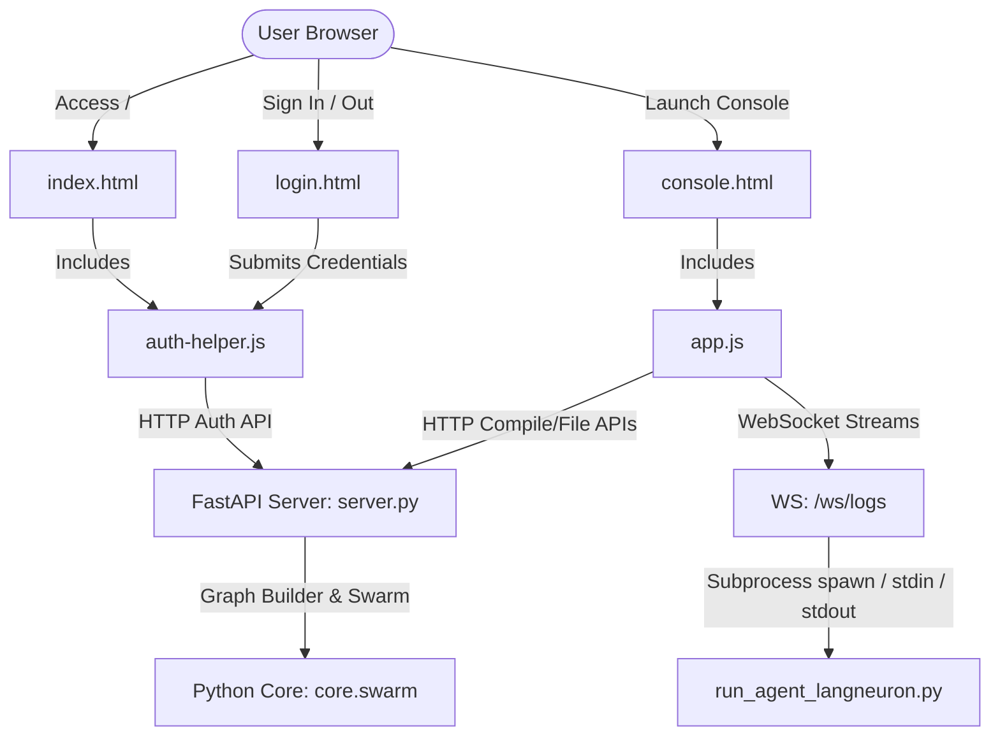
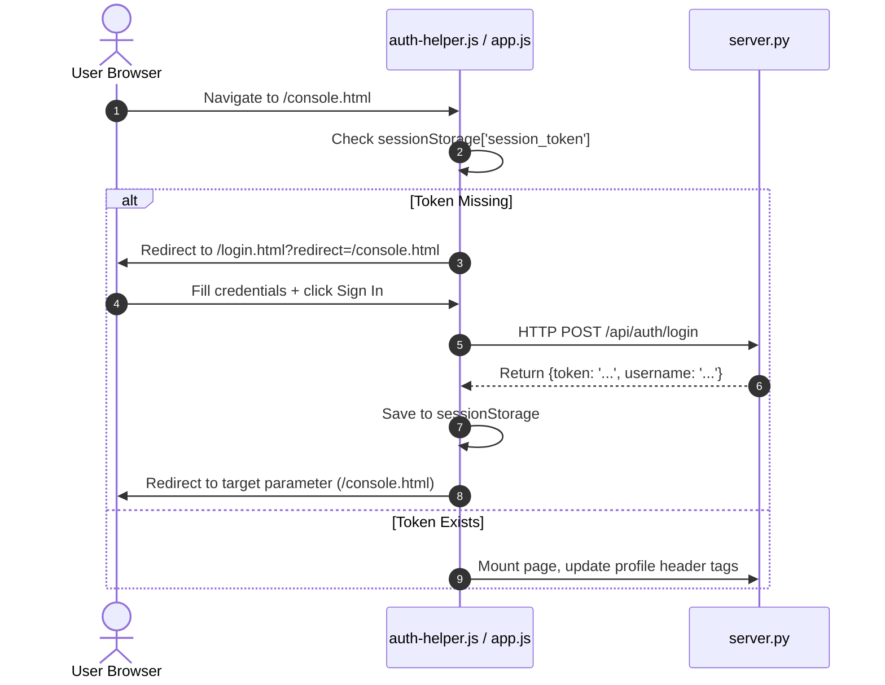

# Low-Level Design (LLD): LangNeurons Frontend Ecosystem

This document details the software architecture, design patterns, component relationships, data flows, and debugging hooks of the **LangNeurons Frontend Workspace** (`/home/swapniljyot/snaptron-git/langneuron_frontend`).

---

## 🏛️ System Architecture Overview

The LangNeurons Frontend is a high-fidelity, client-heavy, micro-interactive web dashboard built using a **single-page-app navigation model** inside the console while serving as a static landing presence for branding.



---

## 📁 File Structure & Component Roles

### 1. Root & Script Files
*   **`server.py`**:
    *   *Role*: Local developer server hosting all pages and bridging the frontend to python core graph executors.
    *   *Technology*: FastAPI, Uvicorn, Websockets.
    *   *Key endpoints*:
        *   `POST /api/auth/login`: Issues session token.
        *   `POST /api/auth/logout`: Invalidate session token.
        *   `POST /api/swarm/compile`: Triggers core builder compile step and returns prompt modules.
        *   `GET /api/docs` & `GET /api/sandbox`: Reads files generated or stored in the core workspace directories.
        *   `WS /ws/logs`: Spawns execution scripts and pipes bidirectional standard input/output.
*   **`test_dashboard.py`**:
    *   *Role*: E2E Integration test validating routing, login, canvas interaction, compilation, settings modal validation, and socket streaming.
    *   *Technology*: Playwright async Python executor.

### 2. Static Resources (`static/`)
*   **`auth-helper.js`**:
    *   *Role*: Client gatekeeper. Automatically checks for `sessionStorage` token presence on public pages. Automatically redirects unauthenticated console visitors to `/login.html` and toggles page headers between *Sign In* / *Sign Out* configurations.
*   **`js/main.js` & Modules**:
    *   *Role*: Domain-scoped ES Modules handling drag-and-drop mechanics, SVG coordinate calculations for pathways, settings inspection toggles, compile HTTP requests, and WebSocket terminal log streams.
*   **Tailwind CSS (Styling)**:
    *   *Role*: Replaced local `style.css` with native utility classes. Custom design configurations, glowing animations, layout states, and scanline overlays are defined inline via standard Tailwind styling utilities.
*   **`login.html`**:
    *   *Role*: Premium split-screen auth gate. Authenticates user inputs and redirects back to target resources using query parameters (`?redirect=...`).
*   **`console.html`**:
    *   *Role*: Primary application interface composed of:
        *   **Left Palette**: Draggable agent neuron types.
        *   **Canvas Workspace**: Visual workspace grid drawing active nodes and connections.
        *   **Bottom Terminal**: Output display for terminal execution logs with custom keyboard send triggers.
        *   **Inspector Settings Dialog**: Tabbed modal overlay displaying compiled instructions, Low-Level Design (LLD) prompts, and associated skills.
*   **Marketing Subpages (`index.html`, `product.html`, `ecosystem.html`, `integrations.html`, `blog.html`, `docs.html`)**:
    *   *Role*: Standardized Tailwind pages presenting marketing specs, documentation contents, and telemetry integrations.

---

## 🔄 Sequence of Key Data Flows

### A. Authentication & Redirects


### B. Drag-and-Drop Node Addition
1. **Drag Start**: User grabs a card in the sidebar (`.neuron-drag-item`). The `dragstart` event sets `e.dataTransfer.setData('text/plain', type)` to the neuron's type (e.g. `chat`, `writer`).
2. **Drag Over**: Canvas container `#workspace-canvas` permits drop events via `e.preventDefault()`.
3. **Drop**: Calculates coordinates relative to the canvas viewport (`canvas.getBoundingClientRect()`).
4. **Node Creation**: Spawns a floating node container inside the canvas with:
    * Custom labels, inputs, and state variables stored in `appState.nodes`.
    * Visual connections (Input/Output connector dots).
    * Mouse click handlers allowing moving nodes and connection creation.

### C. Swarm Connection Routing
1. Active nodes contain left inputs and right outputs.
2. Clicking a node's output connector dot starts a line draw sequence.
3. Hovering and clicking another node's input connector establishes a link in `appState.connections`.
4. The helper function `drawConnections()` parses links and renders dashed curves inside `#connection-svg`.

---

## 📊 Client-Side Application State (`appState`)

The state configuration of the experimentation console workspace is tracked globally inside the `appState` object:

```javascript
let appState = {
    token: sessionStorage.getItem('token') || null,          // Session authorization token
    username: sessionStorage.getItem('username') || null,    // Authenticated username
    nodes: [],                                               // Array of active workspace Agent Nodes
    connections: [],                                         // Array of links between Agent Nodes
    selectedNodeId: null,                                    // ID of the node currently highlighted or opened in inspector
    draggingNode: null,                                      // Reference to node element currently being dragged
    dragOffset: { x: 0, y: 0 },                             // Coordinate offset for smooth drag movements
    connectingFromNodeId: null,                              // Node ID starting a connection draw gesture
    tempLine: null,                                          // SVG line element drawn during click-to-connect gesture
    nodeCounter: 1,                                          // Counter yielding unique incremental IDs for new nodes
    ws: null                                                 // Active WebSocket connection object
};
```

---

## 🛠️ Debugging & Telemetry Guides

When debugging console activity, use the following triage guide:

| Issue | Root Cause Location | Verification Check / Action |
|---|---|---|
| **Canvas connections do not render** | `app.js:drawConnections()` | Inspect the console logs to see if canvas nodes are missing bounds (using `getBoundingClientRect()`). Check if the parent canvas has styling `position: relative`. |
| **Swarm compilation fails** | `server.py:compile_swarm()` | Check if your graph has a root node (a node with no incoming connections). The FastAPI backend expects at least one entry supervisor node to begin swarm parsing. |
| **Terminal output is blank or disconnects** | `server.py:websocket_logs()` | Open Chrome DevTools (`Network` > `WS`). Check if the local websocket handshake on `ws://localhost:8000/ws/logs` succeeded. Verify if `active_process` spawned successfully or crashed. |
| **Authentication loops indefinitely** | `auth-helper.js` | Open Chrome DevTools (`Application` > `Session Storage`). Ensure the token `token_admin_session` is present and matches the value expected by the `/api/` guards. |

---

## 🔧 Extending the Architecture

If you want to add a **new Agent Neuron type**:
1. Open `static/console.html` and append a draggable element to the `<aside>` navigation panel:
   ```html
   <div class="agent-card neuron-drag-item ..." draggable="true" data-type="tester">
       <span class="material-symbols-outlined">bug_report</span>
       <div>
           <div class="font-label-caps">Tester</div>
       </div>
   </div>
   ```
2. Open `static/app.js` and add default properties to the `AGENT_DEFAULTS` map:
   ```javascript
   tester: { role: 'quality_assurance_bot', provider: 'moonshot', model: 'moonshot/kimi-k2.5' }
   ```
3. The rest of the dynamic mapping, schema rendering, and workspace node drag-and-drop will compile and function automatically!
